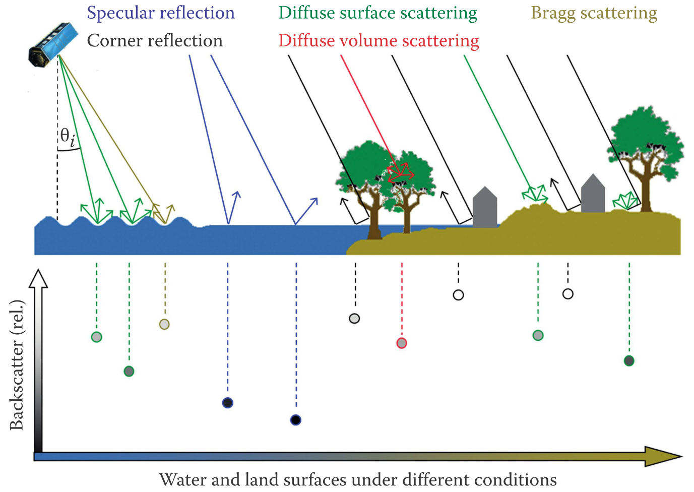
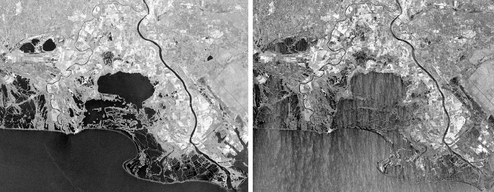
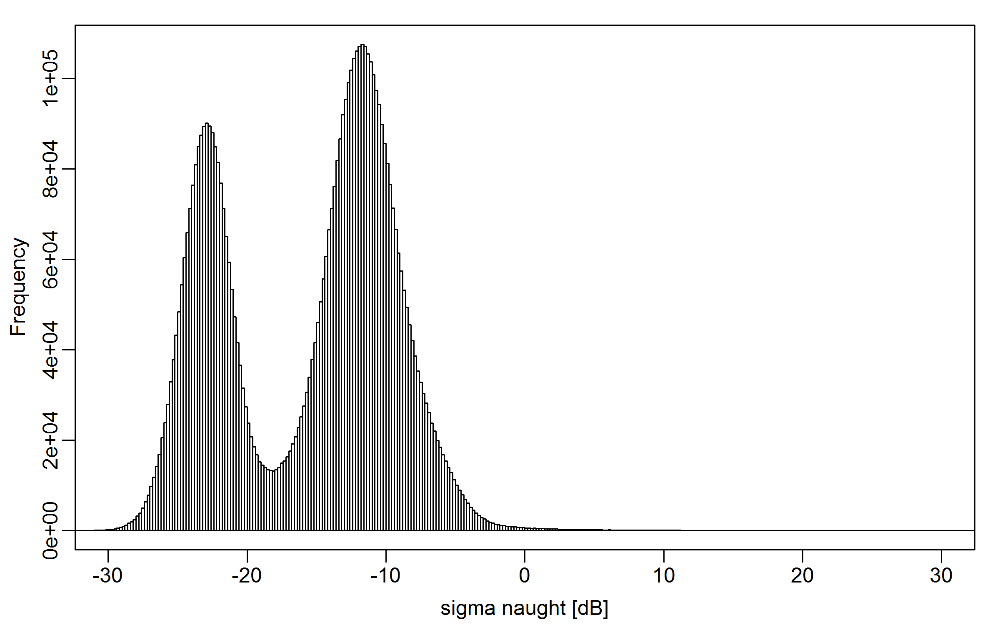
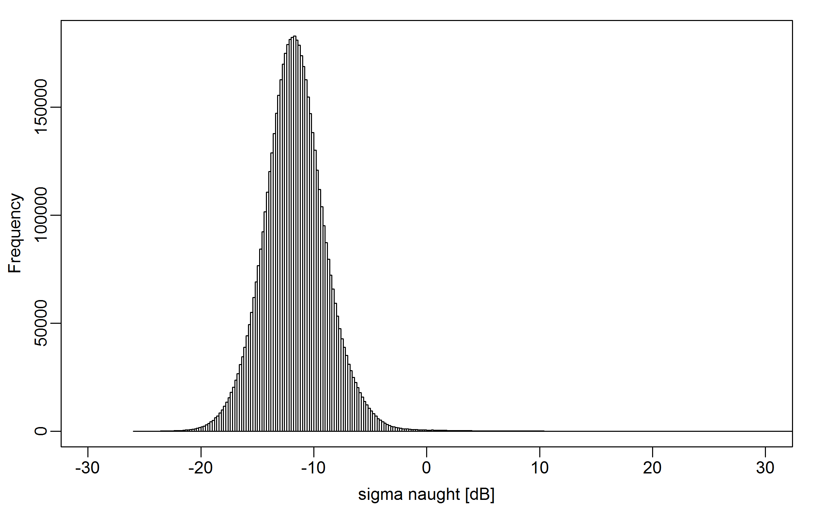

This interface allows for creating water extent maps based on the minimum and maximum backscatter of the time series.

#### Theoretical Background
SAR sensors are side-looking active sensors, emitting their own radiation and sensing the returned signal. The surface geometry is, among other factors, influencing how radiation is scattered. A flat surface will result in strong scattering away from the sensor, while a rougher surface will scatter more radiation back in the same direction it came from. Hence, a smooth water surface will appear dark in the image while a rougher surface will appear bright.  This is exemplified in the following figure.

{ width=100% }
*Scattering mechanisms of water and land surfaces under different environmental conditions as well as specular and diffuse components of surface-scattered radiation as a function of SAR incidence angle and surface roughness [@Martinis16]*

While smooth water surfaces are easily distinguished from land surfaces due to the differences in roughness, a water body at high sea state might appear just as bright as the land surface due to the increased roughness from waves. See the following figure.

{ width=100% }

   
  

*Backscatter characteristics of water surfaces under different environmental conditions. Camargue, Southern France, Sentinel-1 IW VV, acquired on Jan. 01 2015 and Feb. 02 2015 respectively (approx. 50x42 km2).*

While water bodies might appear very bright in single SAR acquisitions, their average backscatter over time is still substantially lower than that of land surfaces. Hence, the two backscatter distributions of land and water can easily be differentiated in an image histogram of multi-temporal statistics like minimum, mean and maximum. A threshold backscatter value separating the two distributions thus classifies the image into land and water.  
In this application an algorithm developed by [@Kittler86] is used. Another prominent example for this task is the method developed by [@Otsu79]. In case the water bodies in the image are significantly smaller than the land area, a clear distribution peak might not be visible in the histogram. Therefore, the image is first split into smaller tiles. Only those tiles with a high standard deviation (i.e. high contrast) and a mean lower than that of the whole image (i.e. likely to contain dark water areas) are selected for thresholding. For each selected tile the threshold is computed and the mode of all thresholds is then applied to the whole image. This approach was adapted in a simplified form from [@Martinis15].

By thresholding the minimum backscatter image, the maximum water extent is classified. The time series of an area which was only temporarily flooded in the mapped period will contain dark water pixels and bright land pixels. Thus, the darkest values corresponding to the flooding will appear in the minimum image and the bright values in the maximum image.

#### References
